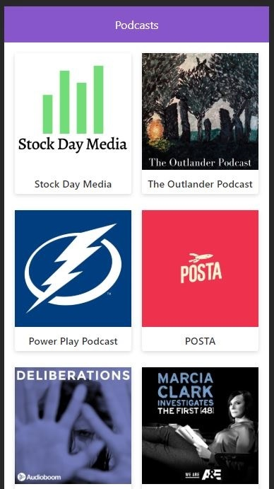

# App de Podcasts con Next.JS

## Demo

[Aqui.]()

## ¿Cómo funciona?

Requiere Node 12

- `npm install` para instalar las dependencias.
- `npm run dev` para el entorno de desarrollo.
- `npm run build && npm start` para el entorno de producción.

## Licencia

MIT
